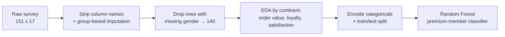

# Customer Analytics & Premium Member Prediction

**Data Science for Business (IS525E) · Final Exam**

**MSc International Business Management & Finance**

  
  
  
  
  

<h3>💭 Can survey data alone tell you which Decathlon customers will become premium members?</h3>

Cross-continent customer survey · EDA & segmentation · Random Forest classification

---

## 📌 TL;DR

| Dataset | Cleaning | Cross-continent finding | Prediction model | Headline result |
|:---:|:---:|:---:|:---:|:---:|
| 151-respondent customer survey, 17 fields | Group-based imputation, then drop 11 rows with missing `gender` (no usable signal to impute) | **Asia** leads on order value, loyalty and recommendation; **America** lags on loyalty | Random Forest predicting premium membership | **85.7% accuracy, 0.88 F1** on premium members, ROC AUC **0.91** |

---

## 📂 Contents

- [❓ The Question](#-the-question)
- [📊 The Data](#-the-data)
- [🔄 Method Pipeline](#-method-pipeline)
- [📈 Results](#-results)
- [🧠 What I'd Do Differently](#-what-id-do-differently)
- [📁 Repo Contents](#-repo-contents)

---

## ❓ The Question

Final exam of the Data Science for Business course, framed as a real CRM/retail analytics brief: a Decathlon customer survey spans three continents, purchase channels, satisfaction and loyalty scores. Before any modeling, the exam asks the questions a retail analyst would ask first —

> **Where are the most valuable, most loyal customers, and does the survey carry enough signal to predict which customers will become premium members?**

## 📊 The Data

| | |
|---|---|
| 🌍 **Source** | Decathlon customer survey |
| 📏 **Size** | 151 respondents × 17 fields (gender, continent, age, purchase channel, product category, purchase frequency, satisfaction/recommendation/loyalty rates, average order amount, premium-member flag) |
| 🧹 **Missingness** | `gender` (11), plus scattered nulls across categorical fields — resolved with group-based imputation first, then the 11 rows with no `gender` were dropped (140 rows remain); a categorical field with no reasonable group to impute against is a real loss of information, not a gap to paper over |

## 🔄 Method Pipeline

## 📈 Results

**Cross-continent findings**

| Metric | America | Asia | Europe |
|---|:---:|:---:|:---:|
| Max average order amount | 30.00 | **249.00** | 248.00 |
| Max loyalty rate | 41% | **66%** | 55% |
| Max recommendation rate | 50% | **66%** | 66% |

- **Asia** leads on nearly every dimension — highest order value, highest loyalty, tied-highest recommendation rate.
- **America** shows the weakest loyalty (41% max) despite a respectable recommendation rate (50%) — a gap between "would recommend" and "stays loyal" worth investigating with more data.
- Customers who buy **several times per month** show the highest satisfaction and communication scores of any frequency segment — frequency of purchase tracks with perceived engagement.
- The distribution of `Average Order Amount` is heavily concentrated in the lowest bin (0–40) — most transactions are low-value, and the exam's own conclusion is that the default bin width hides detail exactly where most of the data sits.

**Premium member prediction (Random Forest)**

| Metric | Value |
|---|---|
| Accuracy | **85.7%** |
| Precision / Recall / F1 — non-premium (0) | 0.88 / 0.78 / 0.82 |
| Precision / Recall / F1 — premium (1) | 0.85 / 0.92 / **0.88** |
| ROC AUC | **0.907** |

Confusion matrix (test set, n=42): 14 true negatives, 4 false positives, 2 false negatives, 22 true positives — the model is notably strong at catching actual premium members (92% recall) without a large false-positive cost. Top drivers by feature importance: `Average Order Amount`, `SATISFACTION_RATE(%)`, `SERVICES_1_to_5`.

## 🧠 What I'd Do Differently

- With only 151 respondents (140 after cleaning), the strong ROC AUC should be read cautiously — a larger sample or cross-validation (rather than a single train/test split) would give a more reliable estimate of generalization.
- Re-bin `Average Order Amount` with finer buckets in the 0–40 range, where the bulk of the distribution sits, before feeding it back into segmentation.
- Investigate the America loyalty/recommendation gap with a dedicated retention-driver model rather than reading it off the aggregate table.

## 📁 Repo Contents

| File | Description |
|---|---|
| `analysis.ipynb` | Full exam notebook — cleaning, cross-continent EDA, and the Random Forest premium-member classifier |

---

**Ludovic Delot Bravo** · MSc International Business Management & Finance · Rennes School of Business
[LinkedIn](https://www.linkedin.com/in/ludovic-delot-bravo) · [GitHub](https://github.com/ludodelot)

